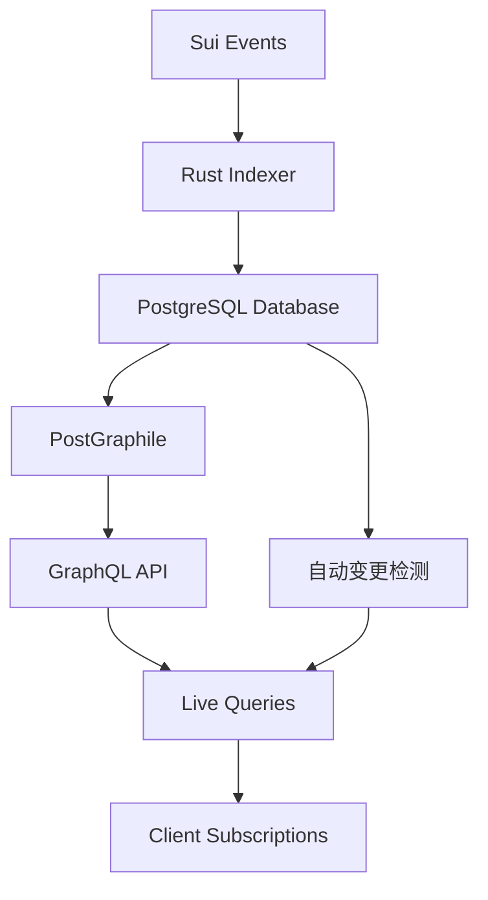

# 🎯 简化的通用表单订阅系统

## 📊 架构概述

我们已经将复杂的自定义subscription系统简化为PostGraphile的原生Live Queries功能。现在当Rust indexer创建表后，GraphQL API会自动支持：

1. **自动Schema生成**：`store_encounter` → `Encounter`类型
2. **自动Query支持**：`encounters`字段 
3. **自动Live Queries**：实时订阅功能

## 🔄 工作流程



## 🛠 架构变更

### ❌ 移除的复杂组件
- 自定义subscription插件
- WebSocket服务器
- PostgreSQL NOTIFY系统
- 复杂的channel管理
- 手动通知发送

### ✅ 保留的核心功能
- PostGraphile原生Live Queries
- 自动表Schema生成
- 自动变更检测
- 简化的日志系统

## 📝 使用示例

### 查询encounters表
```graphql
query {
  encounters {
    nodes {
      id
      playerId
      enemyType
      status
    }
  }
}
```

### 实时订阅encounters变更
```graphql
subscription {
  encounters @live {
    nodes {
      id
      playerId
      enemyType
      status
    }
  }
}
```

## 🧪 测试步骤

1. **启动Rust Indexer**：
   ```bash
   cd packages/sui-rust-indexer
   cargo run
   ```

2. **启动GraphQL服务器**：
   ```bash
   cd packages/graphql-server
   npm start
   ```

3. **访问GraphQL Playground**：
   http://localhost:4000

4. **测试实时功能**：
   - 开启live query
   - 插入数据到数据库
   - 观察实时更新

## 💻 代码变更总结

### GraphQL服务器
- 新增：`simple-subscriptions.ts` - 简化的subscription插件
- 修改：`postgraphile-config.ts` - 启用Live Queries
- 简化：`index.ts` - 移除复杂的subscription manager

### Rust Indexer
- 新增：`simple-notify.rs` - 简化的日志系统
- 修改：`worker.rs` - 使用简化的通知
- 保留：原有的表创建和数据处理逻辑

## 🎁 优势

1. **更简单**：无需管理复杂的WebSocket和通知系统
2. **更可靠**：使用PostGraphile的成熟Live Queries功能
3. **更高效**：自动的变更检测，无需手动发送通知
4. **更易维护**：减少了大量的样板代码
5. **更灵活**：支持复杂的过滤和查询条件

## 🚀 扩展性

新架构支持：
- ✅ 任意数量的store表
- ✅ 复杂的关联查询
- ✅ 高级过滤条件
- ✅ 分页和排序
- ✅ 实时订阅任何查询
- ✅ 自动类型安全

## 🎯 表命名约定

- **数据库表**：`store_{name}` (例如：`store_encounter`)
- **GraphQL类型**：`{Name}` (例如：`Encounter`)
- **GraphQL字段**：`{names}` (例如：`encounters`)

这样就实现了你想要的通用表单系统！现在任何通过indexer创建的表都可以直接query和subscription，无需额外配置。🎉 